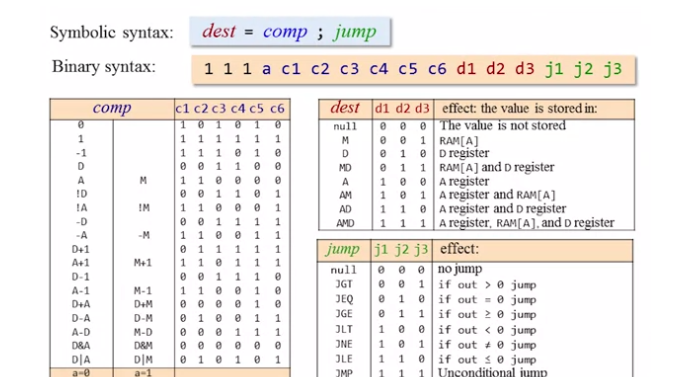
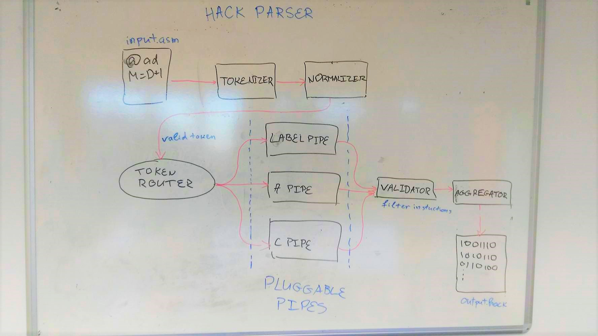

# Nand to tetris
This repository contains HWs and materials from the Coursera course - [Nand To Tetris](https://www.coursera.org/learn/build-a-computer/home/welcome)

## Hack compiler

The compiler takes .asm files:

```assembly
@2
D=A
@3
D=D+A
@0
M=D
```

and spits instructions for the cpu of the hack computer:

```
0000000000000010
1110110000010000
0000000000000011
1110000010010000
0000000000000000
1110001100001000
```

### The compiler

```javascript
import { HackParser } from './hack-assembly-compiler/hack-parser';
import fs from 'fs';


const inFile =  process.argv[2] || '';
const outFile = process.argv[3] || 'a.out';
const parser = new HackParser();

fs.readFile(inFile, 'utf8', (err, src) => {
    if (err) throw err;

    const machineCode = parser
        .loadSrc(src)
        .parse();

    fs.writeFile(outFile, machineCode);
});
```

### 'C' command representation



### Internal design of the parser




## HDL chip implementations

Half adder example

```vhdl
CHIP HalfAdder {
    IN a, b;    // 1-bit inputs
    OUT sum,    // Right bit of a + b 
        carry;  // Left bit of a + b

    PARTS:
    Xor (a=a, b=b, out=sum);
    And (a=a, b=b, out=carry);
}
```

ALU example

```vhdl
CHIP ALU {
    IN  
        x[16], y[16],  // 16-bit inputs
        zx, // zero the x input?
        nx, // negate the x input?
        zy, // zero the y input?
        ny, // negate the y input?
        f,  // compute out = x + y (if 1) or x & y (if 0)
        no; // negate the out output?

    OUT 
        out[16], // 16-bit output
        zr, // 1 if (out == 0), 0 otherwise
        ng; // 1 if (out < 0),  0 otherwise

    PARTS:
    Mux16 (a=x, b=false, sel=zx, out=x1);
    Not16 (in=x1, out=nx1);
    Mux16 (a=x1, b=nx1, sel=nx, out=x2);

    Mux16 (a=y, b=false, sel=zy, out=y1);
    Not16 (in=y1, out=ny1);
    Mux16 (a=y1, b=ny1, sel=ny, out=y2);

    Add16 (a=x2, b=y2, out=sumXY);
    And16 (a=x2, b=y2, out=andXY);
    
    Mux16 (a=andXY, b=sumXY, sel=f, out=muxOut);
    Not16 (in=muxOut, out=nMuxOut);
    Mux16 (a=muxOut, b=nMuxOut, sel=no, out=out); // set out

    Mux16 (a=muxOut, b=nMuxOut, sel=no, out=usableOut);
    Or16Way (in=usableOut, out=nzr);
    Not (in=nzr, out=zr); // set nz

    And16 (a=true, b=usableOut, out[15]=ng); // set ng
}
```


